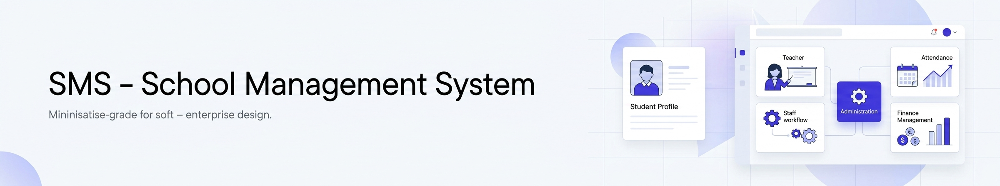
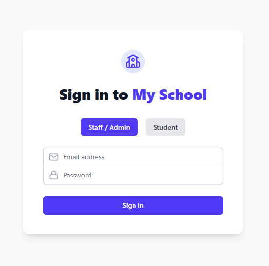
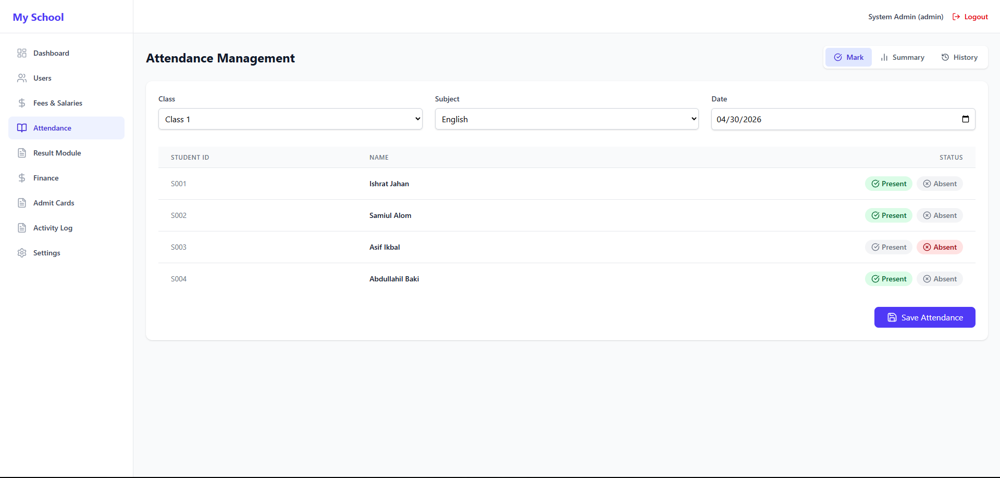
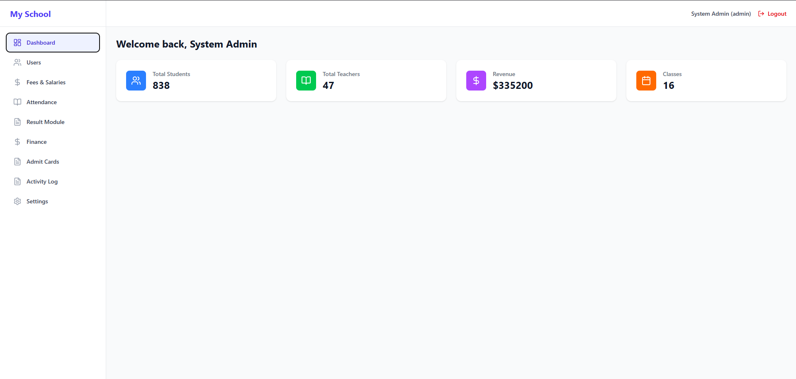

<!DOCTYPE html>
<html>
<head>
<meta charset="UTF-8" />
</head>
<body style="font-family: Arial, sans-serif; line-height: 1.6;">

<h1>SMS – School Management System</h1>

  A scalable, modular, and role-based <strong>School Management System (SMS)</strong>
  built to digitize academic, administrative, attendance, and financial operations.
  This web application includes a structured backend, responsive frontend, and
  multi-role access system for seamless institution management.

<h2>Repository</h2>

  GitHub:
  <a href="https://github.com/Asif551/SMS" target="_blank">
    https://github.com/Asif551/SMS
  </a>

<h2>Core Features</h2>

<h3>Admin</h3>
<ul>
  <li>Create classes, sections, and subjects</li>
  <li>Publish student results</li>
  <li>Add and manage users</li>
  <li>Configure attendance system</li>
  <li>View dashboards and analytics</li>
  <li>Manage announcements</li>
  <li>Generate admit cards</li>
  <li>Configure fee structures</li>
</ul>

<h3>Teacher</h3>
<ul>
  <li>Take attendance (class/subject-wise)</li>
  <li>Insert and update marks</li>
  <li>Save all marks in batch</li>
  <li>Upload study materials</li>
  <li>View assigned subjects and routines</li>
  <li>Track student performance</li>
</ul>

<h3>Student</h3>
<ul>
  <li>View profile and academic details</li>
  <li>Check attendance history</li>
  <li>View and download results</li>
  <li>Download admit cards</li>
  <li>Access study materials</li>
  <li>View notices and routines</li>
</ul>

<h3>Accountant</h3>
<ul>
  <li>Create invoices</li>
  <li>Track payments and dues</li>
  <li>Manage expenses</li>
  <li>Generate finance reports</li>
  <li>View student fee history</li>
</ul>

<h2>Tech Stack</h2>

<h3>Frontend</h3>
<ul>
  <li>HTML</li>
  <li>CSS</li>
  <li>JavaScript</li>
</ul>

<h3>Backend</h3>
<ul>
  <li>Node.js</li>
  <li>Express.js</li>
  <li>Multer (file uploads)</li>
  <li>WebSocket (ws)</li>
</ul>

<h3>Database</h3>
<ul>
  <li>MongoDB or MySQL</li>
</ul>

<h2>Project Structure</h2>
<pre>
/project-root
│── /backend
│   ├── /controllers
│   ├── /routes
│   ├── /models
│   ├── /services
│   └── server.js
│
│── /frontend
│   ├── /public
│   └── /templates
│
│── package.json
│── README.md
│── .env.example
</pre>

<h2>Installation & Setup (Windows)</h2>

<h3>1. Clone Repository</h3>
<pre>git clone https://github.com/Asif551/SMS
cd SMS</pre>

<h3>2. Install Dependencies</h3>
<pre>npm install</pre>

<h3>3. Configure Environment Variables</h3>

Create a <code>.env</code> file:

<pre>
PORT=5000
DB_URL=your_database_url
SECRET_KEY=your_secret
JWT_EXPIRE=7d
ALLOW_FILE_UPLOAD=true
</pre>

<h3>4. Start Development Server</h3>
<pre>npm run dev</pre>

<h3>5. Start Production Server</h3>
<pre>npm start</pre>

<h2>API Overview</h2>

<h3>Auth</h3>
<table border="1" cellpadding="6">
<tr><th>Method</th><th>Endpoint</th><th>Description</th></tr>
<tr><td>POST</td><td>/auth/login</td><td>Login for all roles</td></tr>
<tr><td>POST</td><td>/auth/register</td><td>Create user (admin only)</td></tr>
</table>

<h3>Attendance</h3>
<table border="1" cellpadding="6">
<tr><th>Method</th><th>Endpoint</th><th>Description</th></tr>
<tr><td>POST</td><td>/attendance/take</td><td>Take attendance</td></tr>
<tr><td>GET</td><td>/attendance/student/:id</td><td>Get student attendance</td></tr>
</table>

<h3>Results</h3>
<table border="1" cellpadding="6">
<tr><th>Method</th><th>Endpoint</th><th>Description</th></tr>
<tr><td>POST</td><td>/results/add</td><td>Insert student marks</td></tr>
<tr><td>POST</td><td>/results/publish</td><td>Publish results (admin only)</td></tr>
<tr><td>GET</td><td>/results/student/:id</td><td>View student result</td></tr>
</table>

<h2>Screenshots</h2>

  
  
  

<h2>Roadmap</h2>
<ul>
  <li>Parent login</li>
  <li>Mobile app integration</li>
  <li>Smart routine generator</li>
  <li>Real-time notifications (SMS/Email)</li>
  <li>Multi-campus support</li>
</ul>

<h2>Contribution Guide</h2>
<ul>
  <li>Fork the repository</li>
  <li>Create a new branch</li>
  <li>Commit and push changes</li>
  <li>Open a pull request</li>
</ul>

<h2>Security Notes</h2>
<ul>
  <li>Never commit .env files</li>
  <li>Use strong JWT secrets</li>
  <li>Sanitize all inputs</li>
  <li>Configure CORS properly</li>
  <li>Enable rate limiting</li>
</ul>

<h2>License</h2>

MIT License

<h2>Contact</h2>

Email: asifikbal280@gmail.com

</body>
</html>